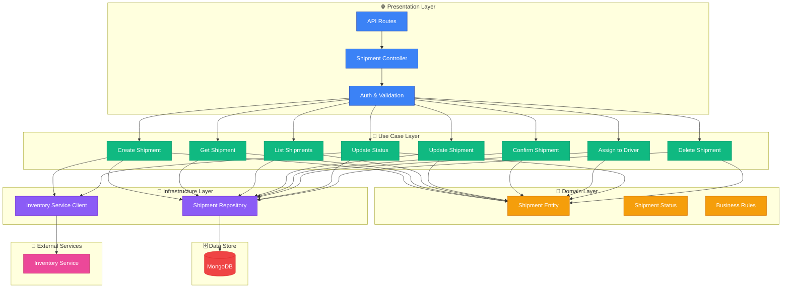
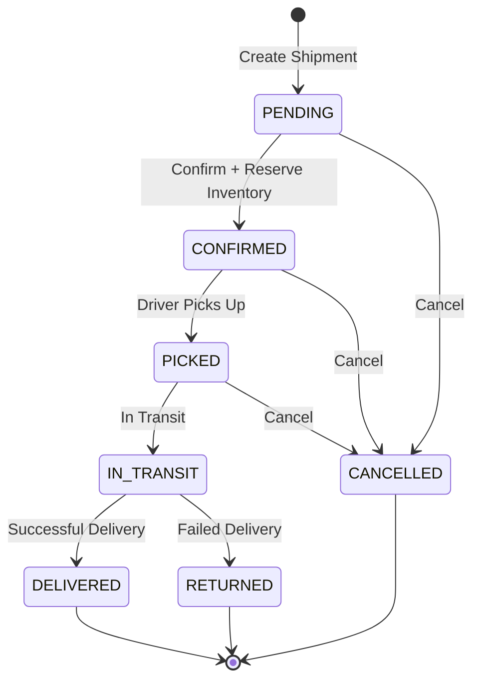

<div align="center">
  <h1>🚚 Fleet OS Shipment Service</h1>
  <p>
    <strong>Order Fulfillment & Delivery Management Microservice</strong>
  </p>

[](https://opensource.org/licenses/ISC)


  <p>
    <a href="#-overview">Overview</a> •
    <a href="#-architecture">Architecture</a> •
    <a href="#-key-features">Features</a> •
    <a href="#-technology-stack">Tech Stack</a> •
    <a href="#-getting-started">Getting Started</a> •
    <a href="#-api-endpoints">API</a>
  </p>
</div>

---

## 📖 Overview

The **Fleet OS Shipment Service** is a comprehensive microservice for managing end-to-end shipment lifecycle within the Fleet OS platform. It orchestrates order fulfillment from creation to delivery, integrating with inventory service for stock management and coordinating driver assignments for last-mile delivery.

### 🎯 Purpose

This service serves as the core shipment orchestration hub, handling:

- **Shipment Lifecycle**: Complete workflow from creation to delivery
- **Inventory Integration**: Automated stock reservation and confirmation
- **Driver Assignment**: Coordinate with fleet management for delivery
- **Tracking & Status**: Real-time shipment status tracking
- **Customer Management**: Customer details and delivery addresses
- **Multi-Item Shipments**: Support for multiple items per shipment

---

## ✨ Key Features

### 📦 Shipment Management

- **Complete CRUD Operations**: Create, read, update, and delete shipments
- **Tracking System**: Unique tracking ID generation
- **Multi-Item Support**: Ship multiple inventory items in one package
- **Customer Information**: Store customer details and delivery preferences
- **Address Management**: Comprehensive address structure with coordinates
- **Soft Delete**: Preserve shipment history with logical deletion

### 🔄 Shipment Lifecycle

- **Status Tracking**: PENDING, CONFIRMED, PICKED, IN_TRANSIT, DELIVERED, CANCELLED, RETURNED
- **Status Transitions**: Controlled state machine with validation
- **Delivery Dates**: Track estimated and actual delivery times
- **Driver Assignment**: Link shipments to assigned drivers
- **Confirmation Flow**: Two-step confirmation before processing

### 📊 Inventory Integration

- **Stock Reservation**: Automatically reserve inventory when shipment is created
- **Reservation Confirmation**: Convert reservations to actual stock deductions on pickup
- **Stock Return**: Release stock back to inventory on cancellation or return
- **Service-to-Service Auth**: Internal API key authentication
- **Automated Sync**: Real-time synchronization with inventory service

### 👤 Driver Operations

- **Driver Assignment**: Assign shipments to drivers
- **Driver View**: Drivers can view and update their assigned shipments
- **Status Updates**: Drivers can update shipment status during delivery
- **Driver Details**: Store driver information with shipment

### 🔍 Advanced Features

- **Multi-Tenant Support**: Complete data isolation per organization
- **Pagination**: Efficient data retrieval for large shipment volumes
- **Filtering**: Filter by status, warehouse, driver, date ranges
- **Search**: Search by tracking ID, customer details
- **Audit Trail**: Track creation and update timestamps

---

## 🏛 Architecture

Built on **Clean Architecture** with service-to-service integration.



### 🧠 Design Patterns

- **Clean Architecture**: Separation of concerns across layers
- **Repository Pattern**: Abstract data persistence
- **Entity Pattern**: Rich domain models with business logic
- **Use Case Pattern**: Single-responsibility operations
- **Client Pattern**: HTTP client for service communication
- **DTO Pattern**: Zod schemas for validation

---

## 🛠 Technology Stack

| Category        | Technology                                                                                                      | Purpose                  |
| :-------------- | :-------------------------------------------------------------------------------------------------------------- | :----------------------- |
| **Runtime**     |          | JavaScript runtime       |
| **Language**    |  | Type-safe development    |
| **Framework**   |        | Web framework            |
| **Database**    |           | Document database        |
| **Cache**       |                 | Caching layer            |
| **HTTP Client** | **Axios**                                                                                                       | Service communication    |
| **Validation**  | **Zod**                                                                                                         | Runtime type checking    |
| **Logging**     | **Winston**                                                                                                     | Structured logging       |
| **Testing**     | **Jest**                                                                                                        | Unit & integration tests |
| **UUID**        | **UUID**                                                                                                        | Unique ID generation     |

---

## 📂 Project Structure

```
fleet-os-shipment-service/
├── src/
│   ├── config/                      # ⚙️ Configuration
│   │   ├── database.ts              # MongoDB connection
│   │   ├── redis.ts                 # Redis client
│   │   └── env.ts                   # Environment validation
│   │
│   ├── domain/                      # 🎯 Core business domain
│   │   ├── entities/                # Domain entities
│   │   │   └── shipment.entity.ts
│   │   ├── enums/                   # Domain enumerations
│   │   │   └── shipment-status.enum.ts
│   │   ├── errors/                  # Custom domain errors
│   │   └── repositories/            # Repository interfaces
│   │       └── shipment.repository.interface.ts
│   │
│   ├── use-cases/                   # 💼 Application business logic
│   │   ├── create-shipment/
│   │   ├── get-shipment/
│   │   ├── list-shipments/
│   │   ├── update-shipment/
│   │   ├── confirm-shipment/
│   │   ├── assign-to-driver/
│   │   ├── update-status/
│   │   └── delete-shipment/
│   │
│   ├── infrastructure/              # 🏗️ External interfaces
│   │   ├── repositories/            # Data persistence
│   │   │   └── shipment.repository.ts
│   │   ├── clients/                 # External service clients
│   │   │   └── inventory-service.client.ts
│   │   └── models/                  # Mongoose schemas
│   │       └── Shipment.ts
│   │
│   ├── presentation/                # 🌐 API layer
│   │   ├── controllers/             # Request handlers
│   │   │   └── shipment.controller.ts
│   │   ├── middlewares/             # Request processing
│   │   │   ├── auth.middleware.ts
│   │   │   └── validate.middleware.ts
│   │   └── routes/                  # API routes
│   │       └── shipment.routes.ts
│   │
│   ├── di/                          # 💉 Dependency injection
│   │   └── container.ts
│   │
│   ├── app.ts                       # Express app setup
│   └── index.ts                     # Server entry point
│
├── tests/                           # 🧪 Test suites
├── .env.example                     # Environment template
├── Dockerfile                       # Production container
└── package.json
```

---

## 🚀 Getting Started

### Prerequisites

- **Node.js** >= 20.x
- **pnpm** >= 9.x
- **MongoDB** >= 6.x
- **Redis** >= 7.x (optional)
- **Inventory Service** running

### Installation

1. **Clone the repository**

```bash
git clone https://github.com/ijas9118/fleet-os-shipment-service.git
cd fleet-os-shipment-service
```

2. **Install dependencies**

```bash
pnpm install
```

3. **Configure environment**

```bash
cp .env.example .env
# Edit .env with your configuration
```

4. **Run development server**

```bash
pnpm dev
```

The service will start on `http://localhost:3002` (or your configured port).

### Running Tests

```bash
# Run all tests
pnpm test

# Watch mode
pnpm test:watch

# Generate coverage report
pnpm test:coverage
```

### Building for Production

```bash
# Type check
pnpm typecheck

# Build
pnpm build

# Start production server
pnpm start
```

---

## 🔌 API Endpoints

Base URL: `/api/v1`

### 📦 Shipment Endpoints

| Method   | Endpoint                | Description                   | Roles                                                  |
| :------- | :---------------------- | :---------------------------- | :----------------------------------------------------- |
| `POST`   | `/shipments`            | Create new shipment           | `TENANT_ADMIN`, `OPERATIONS_MANAGER`                   |
| `GET`    | `/shipments`            | List all shipments            | `TENANT_ADMIN`, `OPERATIONS_MANAGER`, `DRIVER`         |
| `GET`    | `/shipments/:id`        | Get shipment by ID            | `TENANT_ADMIN`, `OPERATIONS_MANAGER`, `DRIVER`         |
| `PUT`    | `/shipments/:id`        | Update shipment details       | `TENANT_ADMIN`                                         |
| `DELETE` | `/shipments/:id`        | Delete shipment (soft)        | `TENANT_ADMIN`, `OPERATIONS_MANAGER`                   |
| `POST`   | `/shipments/:id/confirm` | Confirm shipment              | `TENANT_ADMIN`                                         |
| `POST`   | `/shipments/:id/assign-driver` | Assign driver to shipment | `TENANT_ADMIN`, `OPERATIONS_MANAGER`                   |
| `PATCH`  | `/shipments/:id/status` | Update shipment status        | `TENANT_ADMIN`, `OPERATIONS_MANAGER`, `DRIVER`         |

**Query Parameters for List Shipments:**

- `page` - Page number (default: 1)
- `limit` - Items per page (default: 10)
- `search` - Search by tracking ID or customer name
- `status` - Filter by shipment status
- `warehouseId` - Filter by warehouse
- `driverId` - Filter by assigned driver (drivers automatically filtered to their shipments)

---

## 📝 Data Models

### Shipment Entity

```typescript
{
  id: string;
  tenantId: string;
  warehouseId: string;
  trackingId: string; // Unique tracking identifier
  status: ShipmentStatus; // PENDING, CONFIRMED, PICKED, IN_TRANSIT, DELIVERED, CANCELLED, RETURNED
  items: Array<{
    inventoryItemId: string;
    sku: string;
    name: string;
    quantity: number;
    unit: string;
  }>;
  destinationAddress: {
    line1: string;
    line2?: string;
    city: string;
    state?: string;
    postalCode?: string;
    country: string;
    coordinates?: { lat: number; lng: number };
  };
  customer: {
    name: string;
    email: string;
    phone?: string;
  };
  inventoryReservationId?: string; // Reference to inventory reservation
  driverId?: string; // Assigned driver ID
  driverName?: string; // Driver's name
  notes?: string;
  estimatedDeliveryDate?: Date;
  actualDeliveryDate?: Date;
  deletedAt?: Date;
  createdAt: Date;
  updatedAt: Date;
}
```

### Shipment Status Flow



**Status Descriptions:**

- `PENDING`: Shipment created, awaiting confirmation
- `CONFIRMED`: Confirmed and inventory reserved
- `PICKED`: Driver has picked up the shipment
- `IN_TRANSIT`: En route to destination
- `DELIVERED`: Successfully delivered to customer
- `CANCELLED`: Shipment cancelled
- `RETURNED`: Failed delivery, returned to warehouse

---

## 🔄 Shipment Lifecycle Workflows

### Creating a Shipment

1. **Create Shipment** (`POST /shipments`)
   - Validate items and addresses
   - Generate unique tracking ID
   - Set status to `PENDING`

2. **Reserve Inventory** (via Inventory Service)
   - Call inventory service to reserve stock
   - Store `inventoryReservationId`
   - If reservation fails, shipment creation fails

3. **Confirm Shipment** (`POST /shipments/:id/confirm`)
   - Change status from `PENDING` to `CONFIRMED`
   - Inventory remains reserved

4. **Assign Driver** (`POST /shipments/:id/assign-driver`)
   - Assign driver to shipment
   - Store driver ID and name

### Driver Pickup & Delivery

5. **Mark as Picked** (`PATCH /shipments/:id/status`)
   - Driver updates status to `PICKED`
   - Inventory service confirms reservation (deducts stock)

6. **In Transit** (`PATCH /shipments/:id/status`)
   - Update to `IN_TRANSIT`

7. **Deliver** (`PATCH /shipments/:id/status`)
   - Update to `DELIVERED`
   - Record `actualDeliveryDate`

### Cancellation & Returns

**Cancel Before Pickup:**
- Status: `PENDING` or `CONFIRMED` → `CANCELLED`
- Inventory: Release reservation

**Cancel After Pickup:**
- Status: `PICKED` or `IN_TRANSIT` → `CANCELLED`
- Inventory: Add stock back to warehouse

**Return:**
- Status: `IN_TRANSIT` → `RETURNED`
- Inventory: Add stock back to warehouse

---

## 🔗 Integration with Inventory Service

The shipment service communicates with the inventory service for stock management:

### Reservations

**When:** Shipment is created
**Endpoint:** `POST /api/v1/reservations/reserve`
**Purpose:** Reserve stock for the shipment

### Confirm Reservation

**When:** Shipment status changes to `PICKED`
**Endpoint:** `POST /api/v1/reservations/confirm`
**Purpose:** Convert reservation to actual stock deduction

### Add Stock Back

**When:** Shipment is cancelled or returned
**Endpoint:** `POST /api/v1/internal/stock/add`
**Purpose:** Return stock to available inventory

**Authentication:** Service-to-service using internal API key

---

## 🔐 Authentication & Authorization

- **Authentication**: JWT tokens validated via middleware
- **Authorization**: Role-Based Access Control (RBAC)
  - `PLATFORM_ADMIN` - Full platform access
  - `TENANT_ADMIN` - Tenant-wide shipment management
  - `OPERATIONS_MANAGER` - Operations and driver assignment
  - `DRIVER` - View and update assigned shipments only

**Driver Filtering:** Drivers automatically see only their assigned shipments

---

## 📊 Environment Variables

| Variable                | Description                    | Required | Default       |
| :---------------------- | :----------------------------- | :------- | :------------ |
| `NODE_ENV`              | Environment mode               | No       | `development` |
| `PORT`                  | Server port                    | No       | `3002`        |
| `DATABASE_URL`          | MongoDB connection string      | Yes      | -             |
| `REDIS_URL`             | Redis connection URL           | No       | -             |
| `INVENTORY_SERVICE_URL` | Inventory service base URL     | Yes      | -             |
| `INTERNAL_API_KEY`      | Service-to-service API key     | Yes      | -             |
| `JWT_PUBLIC_KEY_PATH`   | Path to JWT public key         | Yes      | -             |

---

## 🤝 Contributing

Contributions are welcome! Please follow these steps:

1. Fork the repository
2. Create a feature branch (`git checkout -b feature/amazing-feature`)
3. Commit your changes (`git commit -m 'Add amazing feature'`)
4. Push to the branch (`git push origin feature/amazing-feature`)
5. Open a Pull Request

---

## 📄 License

This project is licensed under the **ISC License**.

---

<div align="center">
  <p>Built with ❤️ for the Fleet OS Platform</p>
  <p>
    <a href="https://github.com/ijas9118/fleet-os-shipment-service">GitHub</a> •
    <a href="https://github.com/ijas9118/fleet-os-shipment-service/issues">Issues</a>
  </p>
</div>
